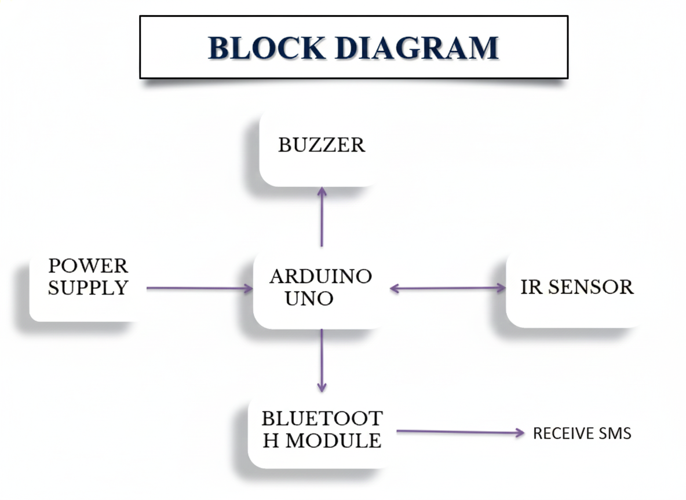
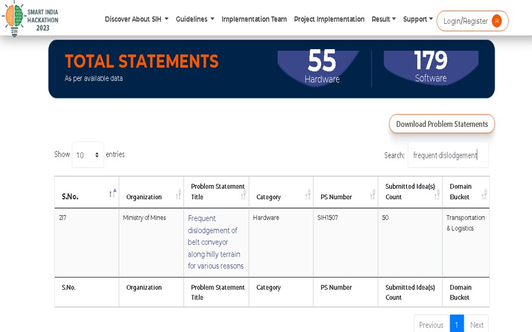

# Conveyor Monitoring System

The device should serve following features   
1. To monitor belt tracking and shut down the system in case of misalignment.  
2. Implementing a Notification Mechanism.  

A belt conveyor is a widely used mechanical system for transporting materials efficiently in various industries. Dislodgment of a belt conveyor can lead to disruptions in production, safety hazards, and potential damage to the equipment. 
Understanding the causes and consequences of belt dislodgment is crucial for ensuring smooth operation and minimizing downtime.

## Objective
The device should serve following features 
-> To Maintain proper troughing angle 

-> To Monitor the belt tracking and keep it always in a central position

-> Implementing a Notification Mechanism

  
  

## Existing Solution
->Conventional approaches to misalignment monitoring in conveyor systems often hinge on manual inspections.  
->Self-aligning idlers are engineered to automatically correct and maintain the alignment of both sides of conveyor belts internally.  
->Regulating the motor to oversee the prevention of conveyor belt misalignment.  

  

## Proposed Solution
Designing a Belt Tracking Monitoring Device by Integrating a Light Sensor Adjacent to the Motor, Employing a Buzzer as an Alarm to Detect Heightened Misalignment, and Incorporating a Bluetooth Module for Instant Alert Notifications.

Block Diagram

  

When the conveyor belt misaligns, the IR sensor detects the misalignment and sends a signal to the Bluetooth module through an Arduino. The HC-05 module then sends a message to the app, alerting the person nearby. After receiving the message, the nearby phone automatically sends an SMS to a higher official. This triggers the relay module to cut off power to the conveyor. This system reduces the need for 24/7 manual inspection and improves productivity.

## Components Required
Arduino UNO board  
Infrared Sensor  
Bluetooth module  
Buzzer  
Connecting Wires  

## App Integration
The mobile application is integrated with the conveyor monitoring system through a Bluetooth module (HC-05). It receives real-time alerts from the Arduino when belt misalignment is detected and immediately notifies nearby workers. The app also sends SMS alerts to higher officials in case of severe misalignment, enabling quick response and ensuring timely shutdown of the conveyor system for safety.

  

## Statement From SIH

  

## Advantages
Improved Efficiency: Proper belt tracking ensures that the conveyor belt stays centered on the rollers, minimizing friction and wear.  
Enhanced Safety: Belt misalignment can lead to accidents such as material spillage, belt slippage, or even belt derailment.  
Real-time Monitoring and Alerts: This allows operators to take immediate corrective actions, preventing potential issues from escalating.  
